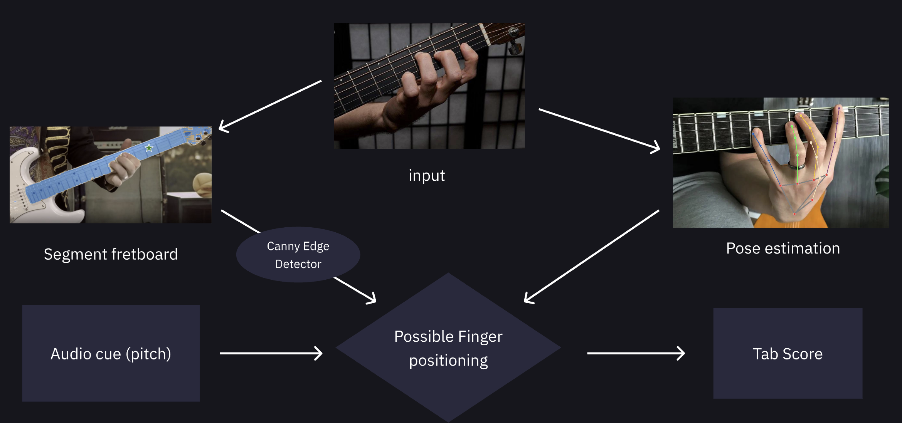

# Montgomery AI: Automatic Guitar Transcription

Montgomery AI is a tool that converts guitar performance videos into tablature (tab) scores. Using AI technologies like Facebook's Segment Anything and Google's MediaPipe, it analyzes video and audio to identify which notes are being played. This project combines computer vision and audio processing to simplify guitar transcription.

## Setup

1. Download [Segment Anything 2.1](https://github.com/facebookresearch/sam2)
2. Download [MediaPipe](https://github.com/google-ai-edge/mediapipe)
3. Navigate to root folder.
4. `conda activate montgomery`
5. `python -m montgomery.main`

## To Run

- `pip install -e .`: one time only
- `python -m montgomery.main`

## Version

- python=3.12
- torch=2.5.1
- numpy=1.26.4

These can be downloaded via `conda create -n montgomery python=3.12 numpy=1.26.4 matplotlib pytorch=2.5.1 torchvision torchaudio -c pytorch`

## Baseline

The result of the program was compared to ChatGPT. The following query was used: "How do you play the intro riff for "______" by _____? Give me the tab score"

## Test videos

Youtube videos were downloaded via "https://cnvmp3.com/", "https://yt1d.com/en12/". The link can be found in `input.json`
