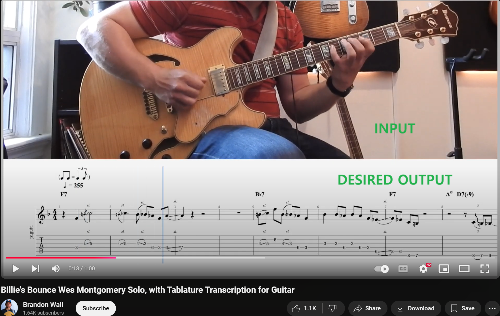
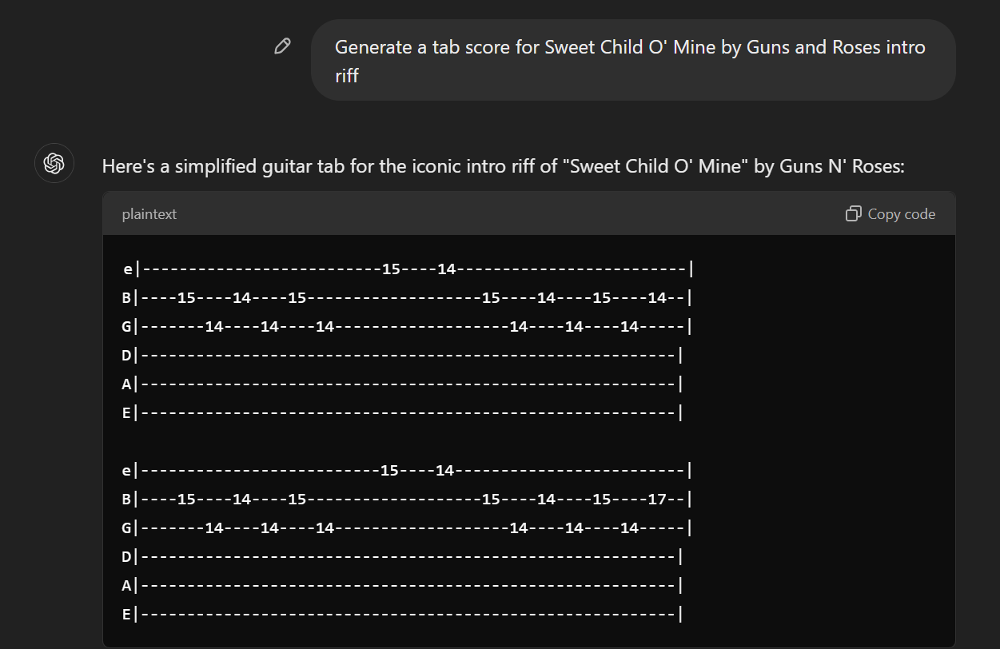
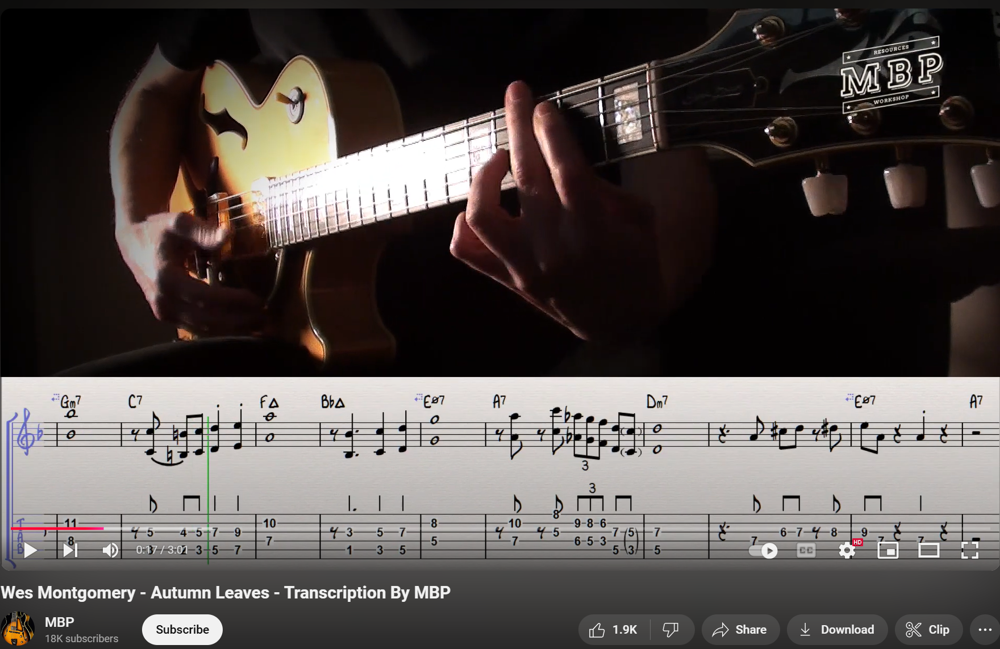

# Project Proposal

EE P 596 - Computer Vision

Sean D Kim

11/5/2024 Tue

# Problem Statement

<aside>
👉 What problem are you trying to solve?

</aside>

- I want to use AI to automatically create a guitar “tab” score (score that displays which finger needs to be on which string & fret) based on a video of someone playing a guitar. Input will be a video and audio of someone playing the guitar and the output is the tab score.

From Youtube

# Problem Relevance

<aside>
👉 Why is the problem interesting and useful in practice?

</aside>

- Transcribing a full guitar score is often a laborious process. Automatic transcription can benefit musicians who want to have more people play their music and amateurs who want to play songs for which they don’t have the score. As there are more independent musicians today who self-produces music, they do not have the luxury to create a score for their work. The problem involves finding the appropriate balance between neural network inferences from the video input (finger tracking and segmentation) and the classical rule-based inference from the audio input. This is explained in more detail in the proposed methods section.

# Prior Art

<aside>
👉 How have others tried to solve this problem?

</aside>

- Previous attempts at automatic music transcription like AnthemScore and Melodyne software have mostly been based on audio cues. This is actually impossible for guitars because unlike most instruments like piano and flute, there are multiple ways to play the same note. My attempt will primarily based on video with some help from audio cues. Also using video as a primary source have potential to store information about how to change fingers, which is not store in just tab scores.
- In addition, tab scores generated by generative AI tools like ChatGPT are often mixed with hallucination. The sample response below is completely wrong; it only shows a subset of notes used and the ordering of the note is completely.

Example of wrong response by ChatGPT

# Proposed Method

<aside>
👉 How will you attempt to solve it? It's a good idea to plan this out in achievable stages

</aside>

Here are the incremental milestones for this project.

1. Given an ***image*** of someone playing a ***single*** note on a guitar, track each finger’s movement using `MediaPipe` Hands developed by google. The guitar player should have only one finger on over the fretboard. Pre-trained model will be used with no additional training. Use `segmentation` to identify the fretboard region and hand. Then use a simple `convolution` for a `edge detection` within the fretboard to detect fret and string alignment (fret and string on a guitar have distinct lines). The image should be taken orthogonal from the fretboard. Guitar position should not change between the images. MacBook M1 Chip will be used for hardware. 
    
    ](./images/mediapipe.png)
    
2. Given a ***video*** of someone playing a ***single*** note on a guitar. Avoid processing the whole video by using audio volume as a cue to take snapshots of the video. Then do the same thing as above. In addition to audio volume, we can also use pitch information to further improve the probability distribution. A classic `rule based inference` will be used (e.g. note C can be played on first fret on fifth string, fifth fret on fourth string, etc). The challenge in this milestone would be finding the right proportion between video-based and audio-based inference. For extracting pitch information, `LibROSA` python library will be used, which uses simple signal processing schema, not neural network. 
3. Use an ***image*** of someone playing ***multiple*** notes on the guitar. This means that multiple fingers may be over the fretboard but only some fingers might be playing or some fingers might be covered by other fingers. More delicate segmentation will be necessary. Pitch information is expected to be used more to identify the “silent” fingers.  
4. Like milestone 2, use a ***video*** of someone playing ***multiple*** notes instead of images. 
5. Use an image that is not perfectly orthogonal to the fretboard and use `affine transformation` to project the fretboard. The guitar should not be moving. 
    
    
    
    Example of non-orthogonal images of guitar playing. From Youtube
    
6. Use video that is not perfectly orthogonal AND guitar is moving slightly as the musician is playing the guitar.