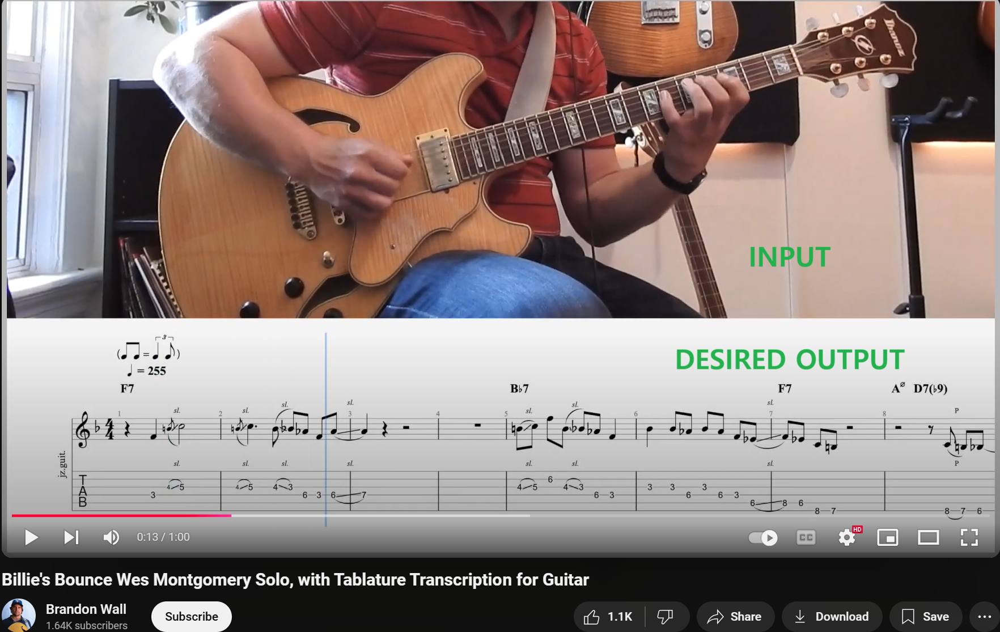
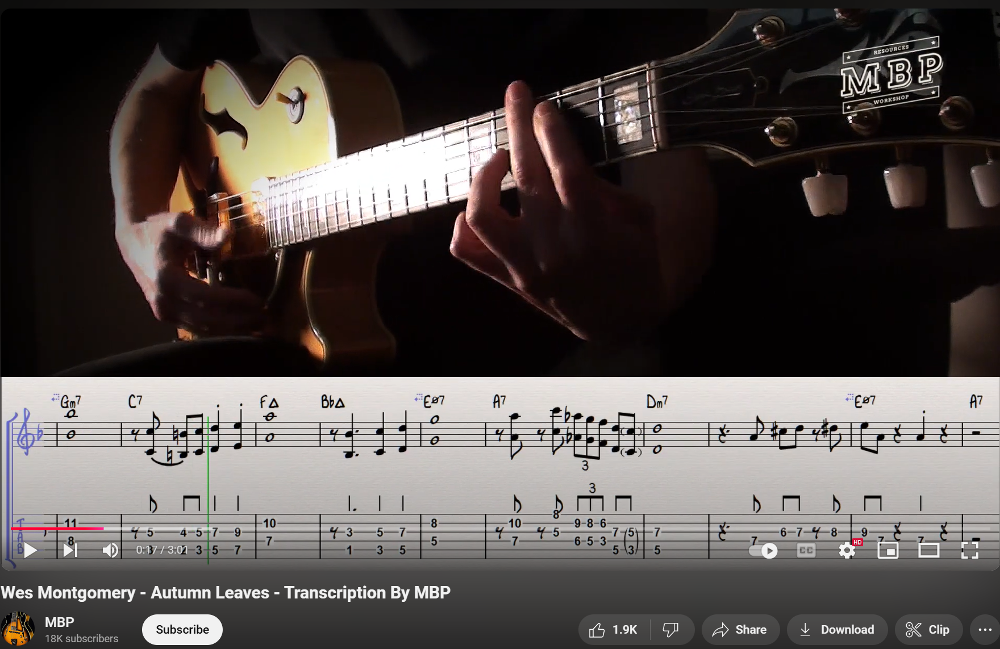

# Revised Project Proposal

EE P 596 - Computer Vision

Sean D Kim

11/22/2024 Fri

1. Problem Statement: copy from the previous report

- I want to use AI to automatically create a guitar “tab” score (score that displays which finger needs to be on which string & fret) based on a video of someone playing a guitar. Input will be a video and audio of someone playing the guitar and the output is the tab score.

*<small>Image sourced from YouTube</small>*

2. Project Summary: by now you should have a clear project summary. What is your goal, what dataset are you using, what baseline are you using, and what is your proposed method.

- Goal: Automatically transcibe a music from a guitar video
- Dataset: Manually generated from youtube video
- Baseline:
  - Text-based LLM: ChatGPT - Ask to generate a tab score for a song
  - Image-based LLM: LLaVa - Ask to transcibe a score given an image/video
- Proposed method
  1. Identify fretboard using segmentation through Facebook's Segment-Anything
  2. Identify the grid inside the fretboard using convolution with an edge detection kernel
  3. Identify the orientation of the fingers using Google's Media Pipe
  4. Use projective geometry to calculate which notes could be playing
  5. Process audio and decide which notes are being played on which string

1. (Detailed) Proposed Method: this should be much more detailed now. We expect the dataset and network architecture to be clearly defined. A basic diagram would also be very helpful (check out draw.io)

   1. Given an ***image*** of someone playing a ***single*** note on a guitar, track each finger’s movement using `MediaPipe` Hands developed by google. The guitar player should have only one finger on over the fretboard. Pre-trained model will be used with no additional training. Use `segmentation` to identify the fretboard region and hand. Then use a simple `convolution` for a `edge detection` within the fretboard to detect fret and string alignment (fret and string on a guitar have distinct lines). The image should be taken orthogonal from the fretboard. Guitar position should not change between the images. MacBook M1 Chip will be used for hardware.

       ](./images/mediapipe.png)

   2. Given a ***video*** of someone playing a ***single*** note on a guitar. Avoid processing the whole video by using audio volume as a cue to take snapshots of the video. Then do the same thing as above. In addition to audio volume, we can also use pitch information to further improve the probability distribution. A classic `rule based inference` will be used (e.g. note C can be played on first fret on fifth string, fifth fret on fourth string, etc). The challenge in this milestone would be finding the right proportion between video-based and audio-based inference. For extracting pitch information, `LibROSA` python library will be used, which uses simple signal processing schema, not neural network.
   3. Use an ***image*** of someone playing ***multiple*** notes on the guitar. This means that multiple fingers may be over the fretboard but only some fingers might be playing or some fingers might be covered by other fingers. More delicate segmentation will be necessary. Pitch information is expected to be used more to identify the “silent” fingers.  
   4. Like milestone 2, use a ***video*** of someone playing ***multiple*** notes instead of images.
   5. Use an image that is not perfectly orthogonal to the fretboard and use `affine transformation` to project the fretboard. The guitar should not be moving.
       
       *<small>Example of non-orthogonal images of guitar playing. From Youtube</small>*

   6. Use video that is not perfectly orthogonal AND guitar is moving slightly as the musician is playing the guitar.

2. Baseline Method: you should have a simple baseline to compare your method to. It can be a very simple network, but you need this to evaluate your proposed method.

3. Dataset: which dataset, how have you split it (train/test/val), how many images in each set, what does the dataset represent

Since I am using a pre-trained model, I need a testing set not necessarily a training set. I am planning to download youtube videos that has both guitar videos and tab score. I am planning to take a snapshot whenever a note is played and manually label the tab numbering. I plan to process 5~10 videos, with each video having 25~50 notes; this gives me about 125~500 images for the testing set.  

7. Preliminary Results (If Available): not mandatory, but include these if you have them

I tried running Segment Anything and MediaPipe locally and ran against some pictures of someone playing the guitar. I verified that (1) segmenting guitar fretboard and (2) extracting hand orientation from an image works in a reasonable time in Macbook Pro M1 GPU Chip.

*<small>Facebook Segment Anything 2.0</small>*

*<small>Google MediaPipe</small>*

8. Planned Ablation Studies/ Future Plan: its good practice to try out different configurations of your proposed method to figure out which one works the best. Trained from scratch or pretrained? Hyperparameter tuning?
